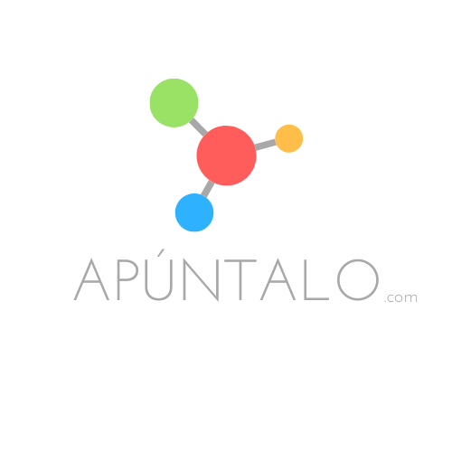

<!-- PROJECT LOGO -->
<br />
<p align="center">
  <a href="https://github.com/nilquera/Apuntalo">
    
  </a>
  <p align="center">
    An awesome collaborative student environment to create, develop and sell your class notes!
    <!-- <br />
    <a href="https://github.com/nilquera/Apuntalo"><strong>Explore the docs »</strong></a>
    <br />
    <br />
    <a href="https://github.com/nilquera/Apuntalo">View Demo</a>
    ·
    <a href="https://github.com/nilquera/Apuntalo/issues">Report Bug</a>
    ·
    <a href="https://github.com/nilquera/Apuntalo/issues">Request Feature</a> -->
  </p>
</p>


<!-- TABLE OF CONTENTS -->
## Índice

* [Sobre Apuntalo](#sobre-apuntalo)
  * [Construido con](#construido-con)
* [Primeros pasos](#primeros-pasos)
  * [Prerequisitos](#prerequisitos)
  * [Instalación](#instalación)
* [Ejemplo de uso](#ejemplo-de-uso)


<!-- Sobre Apuntalo -->
## Sobre Apuntalo

<!--[![Apuntalo Screen Shot][product-screenshot]](https://apuntalo.com)-->

Apuntalo es una webapp para editar documentos relacionados con la universidad de forma colaborativa y en tiempo real. El portal sigue un formato tipo foro, donde los usuarios registrados pueden crear posts en el subforo de su universidad y asignatura. Al crear un post, el usuario decide la visibilidad y la libertad de modificación de los demás usuarios. Más adelante podrá cambiar las propiedades concediendo privilegios de modificación a otras personas de confianza. Con tal de que los usuarios creadores de posts se vean recompensados por sus esfuerzos, existe también la opción de cobrar por descargar o colaborar en un post.

![Diagrama Apuntalo][diagrama]

### Construido con
* [Ethereum](https://ethereum.org/)
* [Node.js](https://nodejs.org/)
* [Angular](https://angular.io/)
* [Etherpad](https://etherpad.org/)
* [MongoDB](https://www.mongodb.com/)

## REST API
El backend consiste en una REST API hecha con nodejs. Consulta el siguiente enlace para ver los endpoints disponibles.
[Documentacion API](https://documenter.getpostman.com/view/4392922/SzS2xoCu?version=latest#1c6af55e-3e91-42e8-90af-9f28e0a32e72)

![Diagrama de clases Apuntalo][clases]


<!-- Primeros Pasos -->
## Primeros pasos

This is an example of how you may give instructions on setting up your project locally.
To get a local copy up and running follow these simple example steps.

### Prerequisitos

This is an example of how to list things you need to use the software and how to install them.
* npm
```sh
npm install npm@latest -g
```

### Instalación

1. Get a free API Key at [https://example.com](https://example.com)
2. Clone the repo
```sh
git clone https://github.com/your_username_/Project-Name.git
```
3. Install NPM packages
```sh
npm install
```
4. Install node, express, angular
```sh
sudo npm install -g angular-cli
sudo npm install -g express --save
sudo apt install nodejs
```
5. Install truffle & ganache (blockchain)
```sh
sudo npm install -g truffle
sudo npm install -g ethereumjs-testrpc
```
4. Enter your API in `config.js`
```JS
const API_KEY = 'ENTER YOUR API';
```


<!-- USAGE EXAMPLES -->
## Ejemplo de uso

Use this space to show useful examples of how a project can be used. Additional screenshots, code examples and demos work well in this space. You may also link to more resources.

_For more examples, please refer to the [Documentation](https://example.com)_


<!-- MARKDOWN LINKS & IMAGES -->
<!-- https://www.markdownguide.org/basic-syntax/#reference-style-links -->
[contributors-shield]: https://img.shields.io/github/contributors/nilquera/apuntalo.svg?style=flat-square
[contributors-url]: https://github.com/nilquera/Apuntalo/graphs/contributors
[forks-shield]: https://img.shields.io/github/forks/nilquera/apuntalo.svg?style=flat-square
[forks-url]: https://github.com/nilquera/Apuntalo/network/members
[stars-shield]: https://img.shields.io/github/stars/nilquera/apuntalo.svg?style=flat-square
[stars-url]: https://github.com/nilquera/Apuntalo/stargazers
[issues-shield]: https://img.shields.io/github/issues/nilquera/apuntalo.svg?style=flat-square
[issues-url]: https://github.com/nilquera/Apuntalo/issues
[license-shield]: https://img.shields.io/github/license/nilquera/apuntalo.svg?style=flat-square
[license-url]: https://github.com/nilquera/Apuntalo/blob/master/LICENSE.txt
[product-screenshot]: img/screenshot.png
[diagrama]: img/diagrama.png
[clases]: img/clases.png
